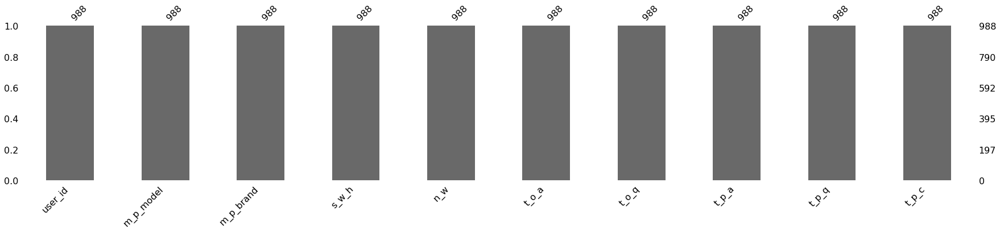
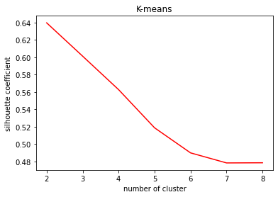
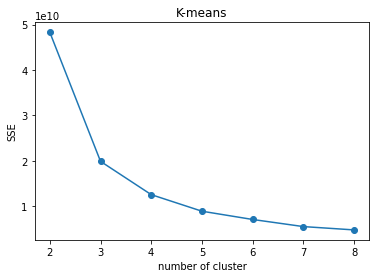
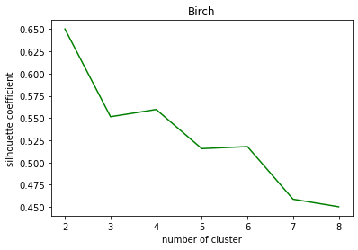
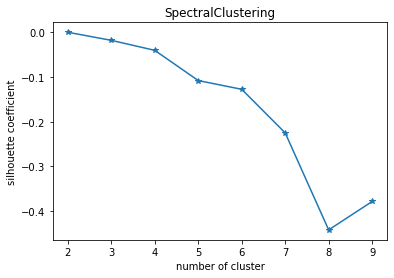
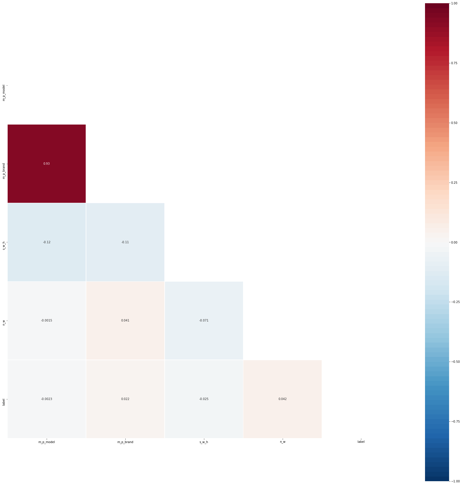
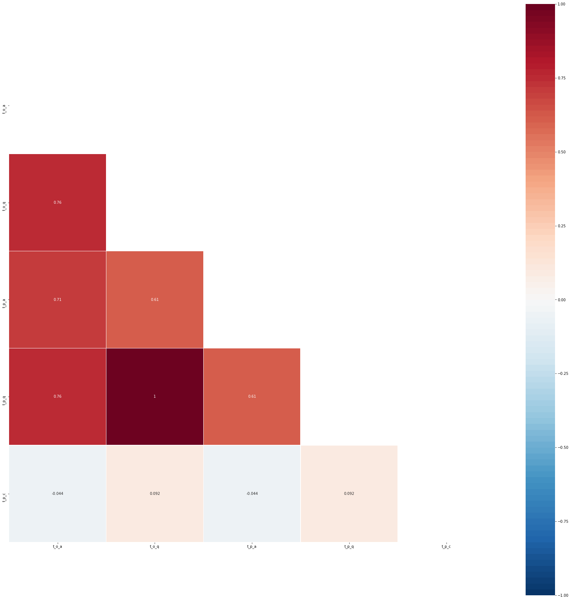

```python
import boto3
import pandas as pd
import io
import re
import time
```


```python
client = boto3.client('athena')
```


```python
response = client.start_query_execution(
    QueryString="select * from \"ab23-db\".\"dws_user_behavior\"",
    QueryExecutionContext={
        'Database': "ab23-db"
    },
    ResultConfiguration={
        'OutputLocation': 's3://ab23-athena-output'
    }
)
```


```python
raw = pd.read_csv("s3://ab23-athena-output/006b6b26-c440-48df-8087-77c7db195f7a.csv") #read data from S3
raw.head(10)
```


<div>
<style scoped>
    .dataframe tbody tr th:only-of-type {
        vertical-align: middle;
    }

    .dataframe tbody tr th {
        vertical-align: top;
    }

    .dataframe thead th {
        text-align: right;
    }
</style>
<table border="1" class="dataframe">
  <thead>
    <tr style="text-align: right;">
      <th></th>
      <th>user_id</th>
      <th>m_p_model</th>
      <th>m_p_brand</th>
      <th>s_w_h</th>
      <th>n_w</th>
      <th>t_o_a</th>
      <th>t_o_q</th>
      <th>t_p_a</th>
      <th>t_p_q</th>
      <th>t_p_c</th>
    </tr>
  </thead>
  <tbody>
    <tr>
      <th>0</th>
      <td>73</td>
      <td>sumsung-16</td>
      <td>Sumsung</td>
      <td>640*1136</td>
      <td>WIFI</td>
      <td>7924.0</td>
      <td>20</td>
      <td>9585.0</td>
      <td>20</td>
      <td>NaN</td>
    </tr>
    <tr>
      <th>1</th>
      <td>73</td>
      <td>sumsung-16</td>
      <td>Sumsung</td>
      <td>640*1136</td>
      <td>WIFI</td>
      <td>7924.0</td>
      <td>20</td>
      <td>9585.0</td>
      <td>20</td>
      <td>NaN</td>
    </tr>
    <tr>
      <th>2</th>
      <td>73</td>
      <td>sumsung-16</td>
      <td>Sumsung</td>
      <td>640*1136</td>
      <td>WIFI</td>
      <td>7924.0</td>
      <td>20</td>
      <td>9585.0</td>
      <td>20</td>
      <td>NaN</td>
    </tr>
    <tr>
      <th>3</th>
      <td>73</td>
      <td>sumsung-16</td>
      <td>Sumsung</td>
      <td>640*1136</td>
      <td>WIFI</td>
      <td>7924.0</td>
      <td>20</td>
      <td>9585.0</td>
      <td>20</td>
      <td>NaN</td>
    </tr>
    <tr>
      <th>4</th>
      <td>138</td>
      <td>sumsung-8</td>
      <td>Sumsung</td>
      <td>640*1136</td>
      <td>3G</td>
      <td>4350.0</td>
      <td>8</td>
      <td>6040.0</td>
      <td>8</td>
      <td>NaN</td>
    </tr>
    <tr>
      <th>5</th>
      <td>138</td>
      <td>Huawei-12</td>
      <td>Huawei</td>
      <td>1080*1920</td>
      <td>3G</td>
      <td>4350.0</td>
      <td>8</td>
      <td>6040.0</td>
      <td>8</td>
      <td>NaN</td>
    </tr>
    <tr>
      <th>6</th>
      <td>138</td>
      <td>sumsung-8</td>
      <td>Sumsung</td>
      <td>640*1136</td>
      <td>3G</td>
      <td>4350.0</td>
      <td>8</td>
      <td>6040.0</td>
      <td>8</td>
      <td>NaN</td>
    </tr>
    <tr>
      <th>7</th>
      <td>138</td>
      <td>Huawei-12</td>
      <td>Huawei</td>
      <td>1080*1920</td>
      <td>3G</td>
      <td>4350.0</td>
      <td>8</td>
      <td>6040.0</td>
      <td>8</td>
      <td>NaN</td>
    </tr>
    <tr>
      <th>8</th>
      <td>138</td>
      <td>sumsung-8</td>
      <td>Sumsung</td>
      <td>640*1136</td>
      <td>3G</td>
      <td>4350.0</td>
      <td>8</td>
      <td>6040.0</td>
      <td>8</td>
      <td>NaN</td>
    </tr>
    <tr>
      <th>9</th>
      <td>138</td>
      <td>Huawei-12</td>
      <td>Huawei</td>
      <td>1080*1920</td>
      <td>3G</td>
      <td>4350.0</td>
      <td>8</td>
      <td>6040.0</td>
      <td>8</td>
      <td>NaN</td>
    </tr>
  </tbody>
</table>
</div>


```python
#screen_width_height as s_w_h,
#network_mode as n_w,
#total_order_amount as t_o_a,
#total_order_qty as t_o_q,
#total_payment_amount as t_p_a,
#total_payment_qty as t_p_q,
#total_praise_count as t_p_c
```


```python
from sklearn.impute import SimpleImputer
import numpy as np
imputer = SimpleImputer(missing_values=np.nan, strategy='most_frequent')
```


```python
raw_tmp = imputer.fit_transform(raw)
col = ['user_id','m_p_model','m_p_brand','s_w_h','n_w','t_o_a','t_o_q','t_p_a','t_p_q','t_p_c']
raw_1 = pd.DataFrame(data=raw_tmp, columns=col)

raw_1.head(10)
```


<div>
<style scoped>
    .dataframe tbody tr th:only-of-type {
        vertical-align: middle;
    }

    .dataframe tbody tr th {
        vertical-align: top;
    }

    .dataframe thead th {
        text-align: right;
    }
</style>
<table border="1" class="dataframe">
  <thead>
    <tr style="text-align: right;">
      <th></th>
      <th>user_id</th>
      <th>m_p_model</th>
      <th>m_p_brand</th>
      <th>s_w_h</th>
      <th>n_w</th>
      <th>t_o_a</th>
      <th>t_o_q</th>
      <th>t_p_a</th>
      <th>t_p_q</th>
      <th>t_p_c</th>
    </tr>
  </thead>
  <tbody>
    <tr>
      <th>0</th>
      <td>73</td>
      <td>sumsung-16</td>
      <td>Sumsung</td>
      <td>640*1136</td>
      <td>WIFI</td>
      <td>7924</td>
      <td>20</td>
      <td>9585</td>
      <td>20</td>
      <td>1384</td>
    </tr>
    <tr>
      <th>1</th>
      <td>73</td>
      <td>sumsung-16</td>
      <td>Sumsung</td>
      <td>640*1136</td>
      <td>WIFI</td>
      <td>7924</td>
      <td>20</td>
      <td>9585</td>
      <td>20</td>
      <td>1384</td>
    </tr>
    <tr>
      <th>2</th>
      <td>73</td>
      <td>sumsung-16</td>
      <td>Sumsung</td>
      <td>640*1136</td>
      <td>WIFI</td>
      <td>7924</td>
      <td>20</td>
      <td>9585</td>
      <td>20</td>
      <td>1384</td>
    </tr>
    <tr>
      <th>3</th>
      <td>73</td>
      <td>sumsung-16</td>
      <td>Sumsung</td>
      <td>640*1136</td>
      <td>WIFI</td>
      <td>7924</td>
      <td>20</td>
      <td>9585</td>
      <td>20</td>
      <td>1384</td>
    </tr>
    <tr>
      <th>4</th>
      <td>138</td>
      <td>sumsung-8</td>
      <td>Sumsung</td>
      <td>640*1136</td>
      <td>3G</td>
      <td>4350</td>
      <td>8</td>
      <td>6040</td>
      <td>8</td>
      <td>1384</td>
    </tr>
    <tr>
      <th>5</th>
      <td>138</td>
      <td>Huawei-12</td>
      <td>Huawei</td>
      <td>1080*1920</td>
      <td>3G</td>
      <td>4350</td>
      <td>8</td>
      <td>6040</td>
      <td>8</td>
      <td>1384</td>
    </tr>
    <tr>
      <th>6</th>
      <td>138</td>
      <td>sumsung-8</td>
      <td>Sumsung</td>
      <td>640*1136</td>
      <td>3G</td>
      <td>4350</td>
      <td>8</td>
      <td>6040</td>
      <td>8</td>
      <td>1384</td>
    </tr>
    <tr>
      <th>7</th>
      <td>138</td>
      <td>Huawei-12</td>
      <td>Huawei</td>
      <td>1080*1920</td>
      <td>3G</td>
      <td>4350</td>
      <td>8</td>
      <td>6040</td>
      <td>8</td>
      <td>1384</td>
    </tr>
    <tr>
      <th>8</th>
      <td>138</td>
      <td>sumsung-8</td>
      <td>Sumsung</td>
      <td>640*1136</td>
      <td>3G</td>
      <td>4350</td>
      <td>8</td>
      <td>6040</td>
      <td>8</td>
      <td>1384</td>
    </tr>
    <tr>
      <th>9</th>
      <td>138</td>
      <td>Huawei-12</td>
      <td>Huawei</td>
      <td>1080*1920</td>
      <td>3G</td>
      <td>4350</td>
      <td>8</td>
      <td>6040</td>
      <td>8</td>
      <td>1384</td>
    </tr>
  </tbody>
</table>
</div>


```python
import missingno
missingno.bar(raw_1,sort='ascending',figsize=(30,5))
```


    <AxesSubplot:>





```python
from sklearn.preprocessing import LabelEncoder
encoder_x=LabelEncoder()
x = encoder_x.fit_transform(raw_1['m_p_model'])
y = encoder_x.fit_transform(raw_1['m_p_brand'])
z = encoder_x.fit_transform(raw_1['s_w_h'])
a = encoder_x.fit_transform(raw_1['n_w'])
```


```python
raw_2 = pd.DataFrame()
```


```python
raw_2['user_id'] = raw_1['user_id']
raw_2['m_p_model'] = x
raw_2['m_p_brand'] = y
raw_2['s_w_h'] = z
raw_2['n_w'] = a
raw_2['t_o_a'] = raw_1['t_o_a']
raw_2['t_o_q'] = raw_1['t_o_q']
raw_2['t_p_a'] = raw_1['t_p_a']
raw_2['t_p_q'] = raw_1['t_p_q']
raw_2['t_p_c'] = raw_1['t_p_c']
```


```python
raw_2.head(10)
```


<div>
<style scoped>
    .dataframe tbody tr th:only-of-type {
        vertical-align: middle;
    }

    .dataframe tbody tr th {
        vertical-align: top;
    }

    .dataframe thead th {
        text-align: right;
    }
</style>
<table border="1" class="dataframe">
  <thead>
    <tr style="text-align: right;">
      <th></th>
      <th>user_id</th>
      <th>m_p_model</th>
      <th>m_p_brand</th>
      <th>s_w_h</th>
      <th>n_w</th>
      <th>t_o_a</th>
      <th>t_o_q</th>
      <th>t_p_a</th>
      <th>t_p_q</th>
      <th>t_p_c</th>
    </tr>
  </thead>
  <tbody>
    <tr>
      <th>0</th>
      <td>73</td>
      <td>47</td>
      <td>2</td>
      <td>1</td>
      <td>2</td>
      <td>7924</td>
      <td>20</td>
      <td>9585</td>
      <td>20</td>
      <td>1384</td>
    </tr>
    <tr>
      <th>1</th>
      <td>73</td>
      <td>47</td>
      <td>2</td>
      <td>1</td>
      <td>2</td>
      <td>7924</td>
      <td>20</td>
      <td>9585</td>
      <td>20</td>
      <td>1384</td>
    </tr>
    <tr>
      <th>2</th>
      <td>73</td>
      <td>47</td>
      <td>2</td>
      <td>1</td>
      <td>2</td>
      <td>7924</td>
      <td>20</td>
      <td>9585</td>
      <td>20</td>
      <td>1384</td>
    </tr>
    <tr>
      <th>3</th>
      <td>73</td>
      <td>47</td>
      <td>2</td>
      <td>1</td>
      <td>2</td>
      <td>7924</td>
      <td>20</td>
      <td>9585</td>
      <td>20</td>
      <td>1384</td>
    </tr>
    <tr>
      <th>4</th>
      <td>138</td>
      <td>56</td>
      <td>2</td>
      <td>1</td>
      <td>0</td>
      <td>4350</td>
      <td>8</td>
      <td>6040</td>
      <td>8</td>
      <td>1384</td>
    </tr>
    <tr>
      <th>5</th>
      <td>138</td>
      <td>23</td>
      <td>1</td>
      <td>0</td>
      <td>0</td>
      <td>4350</td>
      <td>8</td>
      <td>6040</td>
      <td>8</td>
      <td>1384</td>
    </tr>
    <tr>
      <th>6</th>
      <td>138</td>
      <td>56</td>
      <td>2</td>
      <td>1</td>
      <td>0</td>
      <td>4350</td>
      <td>8</td>
      <td>6040</td>
      <td>8</td>
      <td>1384</td>
    </tr>
    <tr>
      <th>7</th>
      <td>138</td>
      <td>23</td>
      <td>1</td>
      <td>0</td>
      <td>0</td>
      <td>4350</td>
      <td>8</td>
      <td>6040</td>
      <td>8</td>
      <td>1384</td>
    </tr>
    <tr>
      <th>8</th>
      <td>138</td>
      <td>56</td>
      <td>2</td>
      <td>1</td>
      <td>0</td>
      <td>4350</td>
      <td>8</td>
      <td>6040</td>
      <td>8</td>
      <td>1384</td>
    </tr>
    <tr>
      <th>9</th>
      <td>138</td>
      <td>23</td>
      <td>1</td>
      <td>0</td>
      <td>0</td>
      <td>4350</td>
      <td>8</td>
      <td>6040</td>
      <td>8</td>
      <td>1384</td>
    </tr>
  </tbody>
</table>
</div>


```python
from sklearn.cluster import KMeans
import matplotlib.pyplot as plt
from sklearn import cluster
from sklearn import metrics

silhouette_score = []
sse = []
k = []
for i in range(2,9):
    est = KMeans(n_clusters=i).fit(raw_2)
    r = est.labels_
    s1 = metrics.silhouette_score(raw_2, r, metric = 'euclidean')
    silhouette_score.append(s1)
    s2 = est.inertia_
    sse.append(s2)
    k.append(i)
    r = []
    s1 = []
    #print(u'K=%s, Silhouette=%.03f, SSE=%.03f' %(k,s1,s2))

#generate silhouette
plt.figure()
plt.title('K-means')
plt.plot(k, silhouette_score , 'r')
plt.xlabel('number of cluster')
plt.ylabel('silhouette coefficient')

#generate SSE
plt.figure()
plt.title('K-means')
plt.plot(k, sse, 'o-')
plt.xlabel('number of cluster')
plt.ylabel('SSE')
plt.show()
```








```python
from sklearn.cluster import Birch
silhouette_score_1 = []
k_1 = []
for i in range(2,9):
    est = Birch(n_clusters=i).fit(raw_2)
    r = est.labels_
    s1 = metrics.silhouette_score(raw_2, r, metric = 'euclidean')
    silhouette_score_1.append(s1)
    k_1.append(i)
    r = []
    s1 = []

#generate silhouette
plt.figure()
plt.title('Birch')
plt.plot(k_1, silhouette_score_1 , 'g')
plt.xlabel('number of cluster')
plt.ylabel('silhouette coefficient')
```


    Text(0, 0.5, 'silhouette coefficient')





```python
from sklearn.cluster import SpectralClustering

est = SpectralClustering(n_clusters=2).fit(raw_1)
r_tmp = est.labels_
s_tmp = metrics.silhouette_score(raw_1, r_tmp, metric = 'euclidean')
print(s_tmp)

silhouette_score_2 = []
k_2 = []
for i in range(2,9):
    est = SpectralClustering(n_clusters=i).fit(raw_1)
    r = est.labels_
    s1 = metrics.silhouette_score(raw_1, r, metric = 'euclidean')
    silhouette_score_2.append(s1)
    k_2.append(i)
    print(u'K=%s,Silhouette=%.03f' %(i,s1))
    r = []
    s1 = []    
```


```python
#generate silhouette
plt.figure()
plt.title('SpectralClustering')
plt.plot(k_2, sil_score , '*-')
plt.xlabel('number of cluster')
plt.ylabel('silhouette coefficient')
```


    Text(0, 0.5, 'silhouette coefficient')





```python
final_model = Birch(n_clusters=3).fit(raw_2)
```


```python
label = final_model.predict(raw_2)
raw_2['label'] = label
raw_2
```


<div>
<style scoped>
    .dataframe tbody tr th:only-of-type {
        vertical-align: middle;
    }

    .dataframe tbody tr th {
        vertical-align: top;
    }

    .dataframe thead th {
        text-align: right;
    }
</style>
<table border="1" class="dataframe">
  <thead>
    <tr style="text-align: right;">
      <th></th>
      <th>user_id</th>
      <th>m_p_model</th>
      <th>m_p_brand</th>
      <th>s_w_h</th>
      <th>n_w</th>
      <th>t_o_a</th>
      <th>t_o_q</th>
      <th>t_p_a</th>
      <th>t_p_q</th>
      <th>t_p_c</th>
      <th>label</th>
    </tr>
  </thead>
  <tbody>
    <tr>
      <th>0</th>
      <td>73</td>
      <td>47</td>
      <td>2</td>
      <td>1</td>
      <td>2</td>
      <td>7924</td>
      <td>20</td>
      <td>9585</td>
      <td>20</td>
      <td>1384</td>
      <td>1</td>
    </tr>
    <tr>
      <th>1</th>
      <td>73</td>
      <td>47</td>
      <td>2</td>
      <td>1</td>
      <td>2</td>
      <td>7924</td>
      <td>20</td>
      <td>9585</td>
      <td>20</td>
      <td>1384</td>
      <td>1</td>
    </tr>
    <tr>
      <th>2</th>
      <td>73</td>
      <td>47</td>
      <td>2</td>
      <td>1</td>
      <td>2</td>
      <td>7924</td>
      <td>20</td>
      <td>9585</td>
      <td>20</td>
      <td>1384</td>
      <td>1</td>
    </tr>
    <tr>
      <th>3</th>
      <td>73</td>
      <td>47</td>
      <td>2</td>
      <td>1</td>
      <td>2</td>
      <td>7924</td>
      <td>20</td>
      <td>9585</td>
      <td>20</td>
      <td>1384</td>
      <td>1</td>
    </tr>
    <tr>
      <th>4</th>
      <td>138</td>
      <td>56</td>
      <td>2</td>
      <td>1</td>
      <td>0</td>
      <td>4350</td>
      <td>8</td>
      <td>6040</td>
      <td>8</td>
      <td>1384</td>
      <td>2</td>
    </tr>
    <tr>
      <th>...</th>
      <td>...</td>
      <td>...</td>
      <td>...</td>
      <td>...</td>
      <td>...</td>
      <td>...</td>
      <td>...</td>
      <td>...</td>
      <td>...</td>
      <td>...</td>
      <td>...</td>
    </tr>
    <tr>
      <th>983</th>
      <td>167</td>
      <td>45</td>
      <td>2</td>
      <td>2</td>
      <td>0</td>
      <td>14764</td>
      <td>28</td>
      <td>16828</td>
      <td>28</td>
      <td>372</td>
      <td>1</td>
    </tr>
    <tr>
      <th>984</th>
      <td>167</td>
      <td>45</td>
      <td>2</td>
      <td>2</td>
      <td>0</td>
      <td>14764</td>
      <td>28</td>
      <td>16828</td>
      <td>28</td>
      <td>372</td>
      <td>1</td>
    </tr>
    <tr>
      <th>985</th>
      <td>167</td>
      <td>45</td>
      <td>2</td>
      <td>2</td>
      <td>0</td>
      <td>14764</td>
      <td>28</td>
      <td>16828</td>
      <td>28</td>
      <td>372</td>
      <td>1</td>
    </tr>
    <tr>
      <th>986</th>
      <td>167</td>
      <td>25</td>
      <td>1</td>
      <td>3</td>
      <td>2</td>
      <td>14764</td>
      <td>28</td>
      <td>16828</td>
      <td>28</td>
      <td>372</td>
      <td>1</td>
    </tr>
    <tr>
      <th>987</th>
      <td>167</td>
      <td>25</td>
      <td>1</td>
      <td>3</td>
      <td>2</td>
      <td>14764</td>
      <td>28</td>
      <td>16828</td>
      <td>28</td>
      <td>372</td>
      <td>1</td>
    </tr>
  </tbody>
</table>
<p>988 rows × 11 columns</p>
</div>


```python
group_label_0 = raw_2[raw_2['label'].isin([0])]
```


```python
t_o_a_0 = pd.to_numeric(group_label_0['t_o_a'])
t_o_q_0 = pd.to_numeric(group_label_0['t_o_q'])
t_p_a_0 = pd.to_numeric(group_label_0['t_p_a'])
t_p_q_0 = pd.to_numeric(group_label_0['t_p_q'])
t_p_c_0 = pd.to_numeric(group_label_0['t_p_c'])
tmp_df_0 = pd.DataFrame()
tmp_df_0['t_o_a'] = t_o_a_0
tmp_df_0['t_o_q'] = t_o_q_0
tmp_df_0['t_p_a'] = t_p_a_0
tmp_df_0['t_p_q'] = t_p_q_0
tmp_df_0['t_p_c'] = t_p_c_0
tmp_df_0.describe()
```


<div>
<style scoped>
    .dataframe tbody tr th:only-of-type {
        vertical-align: middle;
    }

    .dataframe tbody tr th {
        vertical-align: top;
    }

    .dataframe thead th {
        text-align: right;
    }
</style>
<table border="1" class="dataframe">
  <thead>
    <tr style="text-align: right;">
      <th></th>
      <th>t_o_a</th>
      <th>t_o_q</th>
      <th>t_p_a</th>
      <th>t_p_q</th>
      <th>t_p_c</th>
    </tr>
  </thead>
  <tbody>
    <tr>
      <th>count</th>
      <td>156.000000</td>
      <td>156.000000</td>
      <td>156.000000</td>
      <td>156.000000</td>
      <td>156.000000</td>
    </tr>
    <tr>
      <th>mean</th>
      <td>24720.679487</td>
      <td>47.391026</td>
      <td>25470.384615</td>
      <td>47.391026</td>
      <td>1991.205128</td>
    </tr>
    <tr>
      <th>std</th>
      <td>7491.738187</td>
      <td>15.649208</td>
      <td>6374.312366</td>
      <td>15.649208</td>
      <td>1232.459941</td>
    </tr>
    <tr>
      <th>min</th>
      <td>14176.000000</td>
      <td>28.000000</td>
      <td>17213.000000</td>
      <td>28.000000</td>
      <td>1172.000000</td>
    </tr>
    <tr>
      <th>25%</th>
      <td>18890.000000</td>
      <td>39.000000</td>
      <td>19622.000000</td>
      <td>39.000000</td>
      <td>1384.000000</td>
    </tr>
    <tr>
      <th>50%</th>
      <td>22470.000000</td>
      <td>42.000000</td>
      <td>22866.000000</td>
      <td>42.000000</td>
      <td>1384.000000</td>
    </tr>
    <tr>
      <th>75%</th>
      <td>33540.000000</td>
      <td>65.000000</td>
      <td>30180.000000</td>
      <td>65.000000</td>
      <td>1384.000000</td>
    </tr>
    <tr>
      <th>max</th>
      <td>36968.000000</td>
      <td>72.000000</td>
      <td>38052.000000</td>
      <td>72.000000</td>
      <td>5256.000000</td>
    </tr>
  </tbody>
</table>
</div>


```python
group_label_1 = raw_2[raw_2['label'].isin([1])]
```


```python
t_o_a_1 = pd.to_numeric(group_label_1['t_o_a'])
t_o_q_1 = pd.to_numeric(group_label_1['t_o_q'])
t_p_a_1 = pd.to_numeric(group_label_1['t_p_a'])
t_p_q_1 = pd.to_numeric(group_label_1['t_p_q'])
t_p_c_1 = pd.to_numeric(group_label_1['t_p_c'])
tmp_df = pd.DataFrame()
tmp_df['t_o_a'] = t_o_a_1
tmp_df['t_o_q'] = t_o_q_1
tmp_df['t_p_a'] = t_p_a_1
tmp_df['t_p_q'] = t_p_q_1
tmp_df['t_p_c'] = t_p_c_1
tmp_df.describe()
```


<div>
<style scoped>
    .dataframe tbody tr th:only-of-type {
        vertical-align: middle;
    }

    .dataframe tbody tr th {
        vertical-align: top;
    }

    .dataframe thead th {
        text-align: right;
    }
</style>
<table border="1" class="dataframe">
  <thead>
    <tr style="text-align: right;">
      <th></th>
      <th>t_o_a</th>
      <th>t_o_q</th>
      <th>t_p_a</th>
      <th>t_p_q</th>
      <th>t_p_c</th>
    </tr>
  </thead>
  <tbody>
    <tr>
      <th>count</th>
      <td>359.000000</td>
      <td>359.000000</td>
      <td>359.000000</td>
      <td>359.000000</td>
      <td>359.000000</td>
    </tr>
    <tr>
      <th>mean</th>
      <td>10867.674095</td>
      <td>20.122563</td>
      <td>11326.072423</td>
      <td>20.122563</td>
      <td>1393.626741</td>
    </tr>
    <tr>
      <th>std</th>
      <td>2888.617341</td>
      <td>6.651040</td>
      <td>3092.537679</td>
      <td>6.651040</td>
      <td>461.426916</td>
    </tr>
    <tr>
      <th>min</th>
      <td>6158.000000</td>
      <td>8.000000</td>
      <td>6222.000000</td>
      <td>8.000000</td>
      <td>28.000000</td>
    </tr>
    <tr>
      <th>25%</th>
      <td>8280.000000</td>
      <td>15.000000</td>
      <td>8442.000000</td>
      <td>15.000000</td>
      <td>1384.000000</td>
    </tr>
    <tr>
      <th>50%</th>
      <td>11055.000000</td>
      <td>20.000000</td>
      <td>10744.000000</td>
      <td>20.000000</td>
      <td>1384.000000</td>
    </tr>
    <tr>
      <th>75%</th>
      <td>13588.000000</td>
      <td>24.000000</td>
      <td>13816.000000</td>
      <td>24.000000</td>
      <td>1384.000000</td>
    </tr>
    <tr>
      <th>max</th>
      <td>17292.000000</td>
      <td>36.000000</td>
      <td>17101.000000</td>
      <td>36.000000</td>
      <td>3492.000000</td>
    </tr>
  </tbody>
</table>
</div>


```python
group_label_2 = raw_2[raw_2['label'].isin([2])]
t_o_a_2 = pd.to_numeric(group_label_2['t_o_a'])
t_o_q_2 = pd.to_numeric(group_label_2['t_o_q'])
t_p_a_2 = pd.to_numeric(group_label_2['t_p_a'])
t_p_q_2 = pd.to_numeric(group_label_2['t_p_q'])
t_p_c_2 = pd.to_numeric(group_label_2['t_p_c'])
tmp_df_2 = pd.DataFrame()
tmp_df_2['t_o_a'] = t_o_a_2
tmp_df_2['t_o_q'] = t_o_q_2
tmp_df_2['t_p_a'] = t_p_a_2
tmp_df_2['t_p_q'] = t_p_q_2
tmp_df_2['t_p_c'] = t_p_c_2
tmp_df_2.describe()
```


<div>
<style scoped>
    .dataframe tbody tr th:only-of-type {
        vertical-align: middle;
    }

    .dataframe tbody tr th {
        vertical-align: top;
    }

    .dataframe thead th {
        text-align: right;
    }
</style>
<table border="1" class="dataframe">
  <thead>
    <tr style="text-align: right;">
      <th></th>
      <th>t_o_a</th>
      <th>t_o_q</th>
      <th>t_p_a</th>
      <th>t_p_q</th>
      <th>t_p_c</th>
    </tr>
  </thead>
  <tbody>
    <tr>
      <th>count</th>
      <td>473.000000</td>
      <td>473.000000</td>
      <td>473.000000</td>
      <td>473.000000</td>
      <td>473.000000</td>
    </tr>
    <tr>
      <th>mean</th>
      <td>3476.579281</td>
      <td>7.372093</td>
      <td>3179.621564</td>
      <td>7.372093</td>
      <td>1494.917548</td>
    </tr>
    <tr>
      <th>std</th>
      <td>1651.619671</td>
      <td>4.065802</td>
      <td>1822.533180</td>
      <td>4.065802</td>
      <td>595.176583</td>
    </tr>
    <tr>
      <th>min</th>
      <td>566.000000</td>
      <td>1.000000</td>
      <td>231.000000</td>
      <td>1.000000</td>
      <td>204.000000</td>
    </tr>
    <tr>
      <th>25%</th>
      <td>2192.000000</td>
      <td>4.000000</td>
      <td>1748.000000</td>
      <td>4.000000</td>
      <td>1384.000000</td>
    </tr>
    <tr>
      <th>50%</th>
      <td>3402.000000</td>
      <td>6.000000</td>
      <td>3246.000000</td>
      <td>6.000000</td>
      <td>1384.000000</td>
    </tr>
    <tr>
      <th>75%</th>
      <td>4590.000000</td>
      <td>10.000000</td>
      <td>4308.000000</td>
      <td>10.000000</td>
      <td>1384.000000</td>
    </tr>
    <tr>
      <th>max</th>
      <td>6696.000000</td>
      <td>18.000000</td>
      <td>8160.000000</td>
      <td>18.000000</td>
      <td>3956.000000</td>
    </tr>
  </tbody>
</table>
</div>


```python
import seaborn as sns
mask = np.zeros_like(raw_2.corr())
mask[np.triu_indices_from(mask)] = True
fig=plt.figure(figsize=(30,30))
sns.heatmap(raw_2.corr(),vmin=-1,vmax=1,mask=mask,annot=True,square=True,cmap=sns.color_palette("RdBu_r",100),linewidth=.5)
```


    <AxesSubplot:>





```python
mask = np.zeros_like(tmp_df.corr())
mask[np.triu_indices_from(mask)] = True
fig=plt.figure(figsize=(30,30))
sns.heatmap(tmp_df.corr(),vmin=-1,vmax=1,mask=mask,annot=True,square=True,cmap=sns.color_palette("RdBu_r",100),linewidth=.5)
```


    <AxesSubplot:>





```python
#screen_width_height as s_w_h,
#network_mode as n_w,
#total_order_amount as t_o_a,
#total_order_qty as t_o_q,
#total_payment_amount as t_p_a,
#total_payment_qty as t_p_q,
#total_praise_count as t_p_c
```


```python

```
